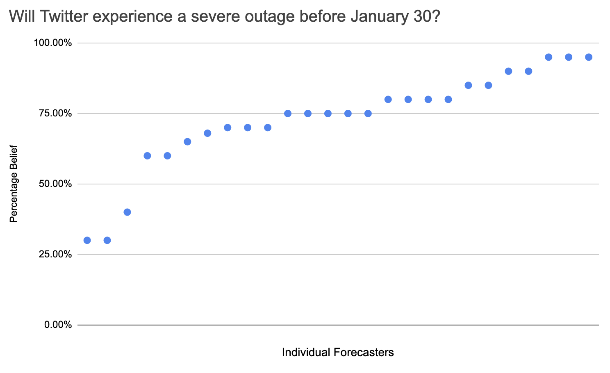

## UPDATE 2023-01-17

I'm closing this forecast as `Yes` following the recently observed Twitter outage in December.

The scores are:

- **Panel Brier score:** `0.20768461538461536`
- **Consensus Brier score:** `0.14788431952662726`

I have a footnote about the two scores below.

We'll start with a discussion of the conditions that needed to be met for this to be a `Yes`.

Coverage by three US newspapers of record describe the outage with the terms we were looking for: The `widespread` keyword was used in all three articles, and we only needed one.

1. [NYT - Twitter Users Report Widespread Service Interruptions](https://www.nytimes.com/2022/12/28/technology/twitter-outages.html)
2. [WSJ - Some Twitter Users Experience Technical Problems With Platform](https://www.wsj.com/articles/some-twitter-users-experience-technical-problems-with-platform-11672280111)
3. [WaPo - Twitter experiences a widespread global outage](https://www.washingtonpost.com/technology/2022/12/28/twitter-global-outage/)

The second condition was "An account of measurable downtime of over an hour". This narrowly passes my judgement. All three articles reference "measurable downtime of over an hour" by citing [DownDetector](https://downdetector.com/). I am not a big fan of this source of measurement and I am thankful that we had two other conditions to rely on.

The third condition passes easily. Each linked article noted that there was an inability read or write tweets, which was a required aspect of the forecast.

This forecast could have been improved. I wanted to capture the doom and gloom present in people's predictions in explicit terms. I think a pretty mediocre Twitter outage passed through these terms. This was an outage nonetheless, though maybe not the crisis people were anticipating.

Next, there was some debate about what "[Newspaper of Record](https://en.wikipedia.org/wiki/Newspaper_of_record)" meant while judging the forecast. This term may have some subjectivity, so I think it makes sense to include a small group of major newspapers and news wire services. Then we can debate whether things are added to the list or not.

> Footnote: If you follow these forecasts regularly, you'll notice there are two scores now. The _Consensus_ score uses the same method as previous forecasts. The consensus score comes from the average parameters (like `Yes` and `No`) from the panel. The _Panel_ score is the average of each individual panelists score.

## The Forecast

Will Twitter experience a severe outage before January 30?

There's a lot of speculation that Twitter may have an outage due to [severe layoffs](https://www.bbc.com/news/business-63672307) following Elon Musk's recent purchase.

We put together the following conditions, and used a Slack bot to elicit forecasts against it.

A "severe outage" would need to include all of the following:

1. Coverage by a major US newspaper of record describing a Twitter outage as widespread, large, severe, critical, painful, or embarrassing.  
2. A account of measurable downtime of over an hour by a US based newspaper of record.
3. Any inability for Twitter users to read or create tweets over the course of this time.

The presence of a status page or other indicator of an outage (eg: FailWhale) indicating a failure for over an hour will automatically count as a "severe outage".

The outage cannot be caused by a larger internet ecosystem outage, unrelated censorship. The outage must occur before, or on, January 31, 2023. Final judgement will come from interpretation of the rules by @magoo on February 1st 2023.

## The panel results

The panel expects a `72.8%` chance of observing a severe outage by January 30, 2023. Here's how their forecasts were distributed:

That's me at 30% in the image, by the way. I was very surprised the panel shot so high. I thought 30% was pessimistic!

A panel of 26 individuals I organized were [elicited](/risk-measurement/docs/estimation/expert-elicitation/) for a [forecast](/risk-measurement/docs/intro/for-noobs) suggesting the individual's probabilistic assessment of whether this scenario would take place.

The following links were discussed by the group over the weekend:

- [https://twitter.com/daveyalba/status/1593769814476161026](https://twitter.com/daveyalba/status/1593769814476161026)
- [https://twitter.com/kyliebytes/status/1593391167718113280](https://twitter.com/kyliebytes/status/1593391167718113280)
- [https://twitter.com/jasonbaumgartne/status/1593573576346517504](https://twitter.com/jasonbaumgartne/status/1593573576346517504)
- [https://www.wired.com/story/twitter-two-factor-sms-problems/](https://www.wired.com/story/twitter-two-factor-sms-problems/)
- [https://twitter.com/mikecvet/status/1593670868915261440](https://twitter.com/mikecvet/status/1593670868915261440)

## What's next?

We wait to see if the criteria are met before 2023-01-30.

If you'd like, you can post your own forecast and compare with us in January 2023. Make sure you do it soon. Put your forecast on Twitter or commit it to a repository.

The forecast will be [scored](https://magoo.github.io/risk-measurement/docs/estimation/calibration/) in January 2023. Since we've thoroughly covered the discussions we've had, we can review where we were on/off the right track.

To receive updates on future forecasts, follow [@magoo](https://www.twitter.com/magoo) or subscribe here 👇

<iframe
scrolling="no"
style="width:100%!important;height:220px;border:0px #ccc solid !important"
src="https://buttondown.email/risk?as_embed=true"
></iframe>  
